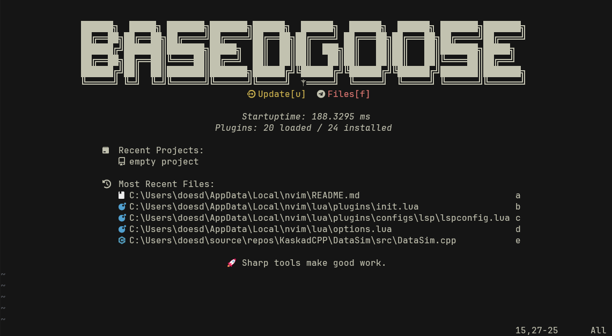
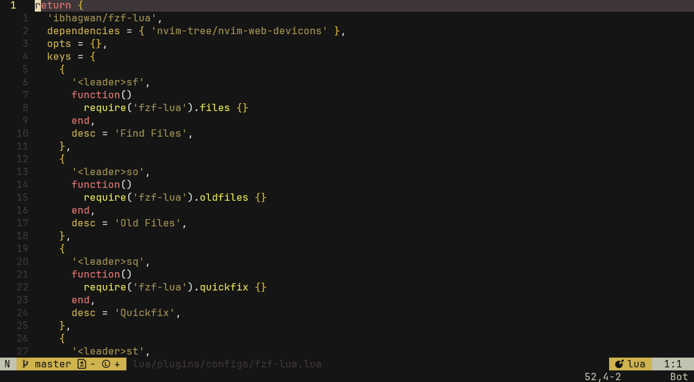

# basedgoose.nvim

**A Neovim configuration based on [kickstart.nvim](https://github.com/nvim-lua/kickstart.nvim)**  
---



---

## Requirements

- **Neovim** 0.11+
- [fzf](https://github.com/junegunn/fzf)
- [ripgrep](https://github.com/BurntSushi/ripgrep)
- [fd](https://github.com/sharkdp/fd)
- [A Nerd Font](https://www.nerdfonts.com/font-downloads)
---

## Installation

```bash
git clone https://github.com/obsqrbtz/basedgoose.nvim.git ~/.config/nvim
```
